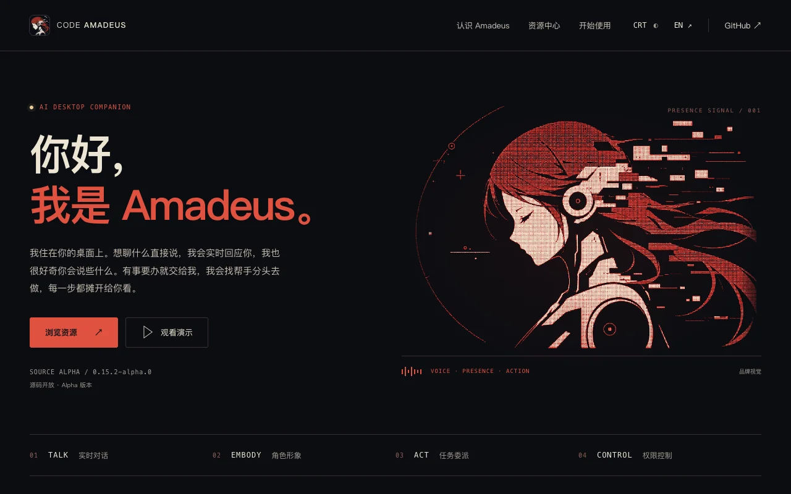
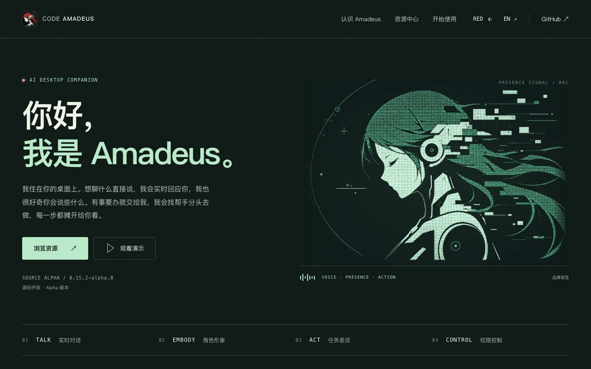
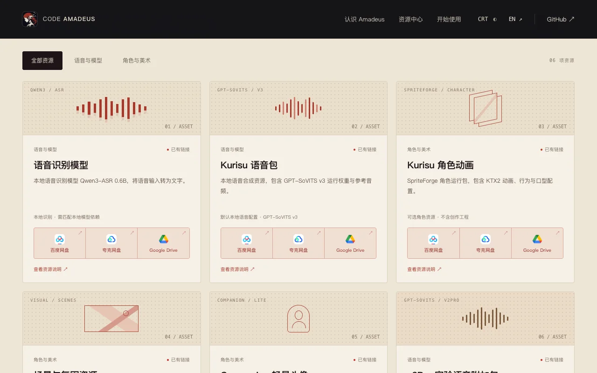
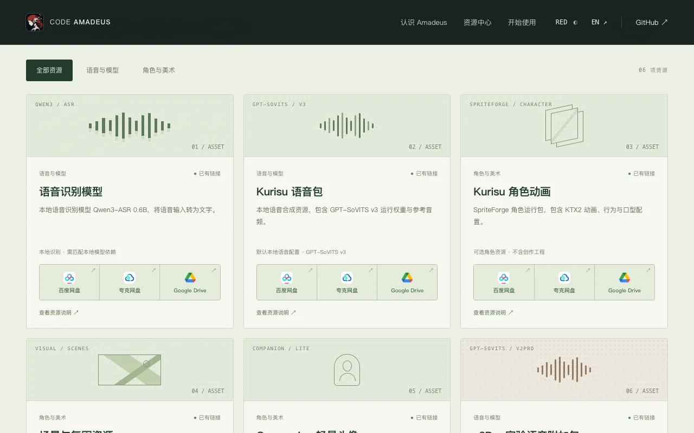
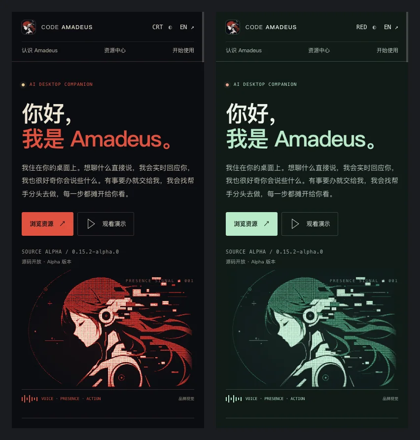

# Code Amadeus — Website & Resource Library

The official home page of [Amadeus](https://github.com/Code-Amadeus/Amadeus), an AI companion that lives on your desktop.

**Visit: https://code-amadeus.github.io/**



## What's on the site

- **Meet Amadeus** — what the app does, with a short demo: talk by voice or text, see the character on screen, and hand tasks off to agents.
- **Resource library** — voice packs, character animations, scenes and portraits, each with one-click download links for Baidu Pan, Quark Pan and Google Drive. Share links already include their passwords.
- **Get started** — three steps from a fresh install to a fully voiced character.
- **Always current** — the version number shown on the page follows the latest Amadeus release automatically.
- **Two looks** — the red-and-black palette of the original Amadeus artwork by default, or a CRT green. The choice is remembered.
- **中文 / English** — switch languages at any time from the top bar.
- **Works on phones** — every section adapts to small screens.

## Preview

| Red & black (default) | CRT green |
| --- | --- |
|  |  |
|  |  |

On mobile:



## Deploy your own copy

The site is hosted for free on GitHub Pages and publishes itself — no server to manage.

1. **Fork** this repository.
2. In your fork, open **Settings → Pages** and set **Source** to **GitHub Actions**.
3. Open the **Actions** tab and enable workflows (forks have them switched off by default).
4. Push to `main`, or run **Website Pages** from the Actions tab.

A minute or two later the site is live at `https://<your-username>.github.io/Code-Amadeus.github.io/`.
From then on, every push to `main` republishes it, and it refreshes itself every six hours
to pick up new Amadeus releases.

<details>
<summary>Show a new release immediately</summary>

Instead of waiting for the next scheduled refresh, the Amadeus release process can ping the site:

```sh
gh api repos/Code-Amadeus/Code-Amadeus.github.io/dispatches -f event_type=amadeus-release
```

This needs a token that can write to this repository, stored as a secret in the Amadeus repository.

</details>

## Preview on your computer

Install [Node.js](https://nodejs.org/) 22.12 or newer, then:

```sh
npm install
npm run dev
```

Open http://localhost:4321 — the page reloads as you edit.

## Updating download links

All resources live in one file, **`resources.json`**. Each resource has an entry per cloud drive:

```json
"mirrors": {
  "baidu":  { "url": "https://pan.baidu.com/s/…?pwd=abcd" },
  "quark":  { "url": "https://pan.quark.cn/s/…" },
  "mega":   null,
  "google": { "url": "https://drive.google.com/drive/folders/…" }
}
```

- Use `null` while a link isn't ready — the card shows "Coming soon". MEGA stays hidden until it has a link.
- If a link doesn't carry its own password, add `"code": "abcd"` and the card will show it.
- If the download is a password-protected ZIP, add `"archive_password": "…"`.
- Every title and description has a Chinese (`zh`) and English (`en`) version.

Mistakes such as a missing translation or a non-HTTPS link stop the site from publishing, so a broken card never goes live.
For what each resource pack contains, see the Amadeus
[resource pack guide](https://github.com/Code-Amadeus/Amadeus/blob/main/docs/external_asset_bundles.md).

## License

The website code is licensed under AGPL-3.0 — see [LICENSE](LICENSE).
Characters, voices, models, original-work content, artwork and the cloud-drive logos belong to their
respective owners; the code license does not cover them. Their sources are listed in
[docs/ASSETS.md](docs/ASSETS.md), and the resource section of the site carries Chinese and English
notices for Kurisu-related character and voice content.
